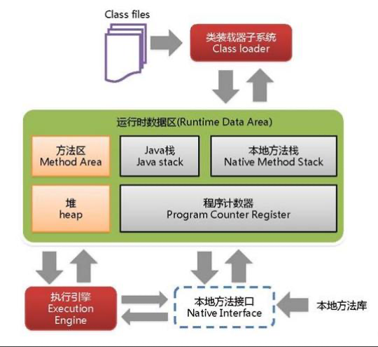
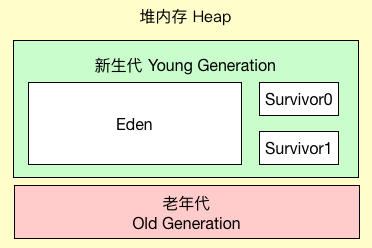
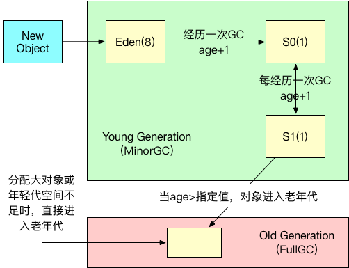

### 什么是JVM
java virtual machine（java虚拟机）的缩写。包括一套字节码指令集、一组寄存器、一个栈、一个垃圾回收堆和一个存储方法域。jvm屏蔽了与具体操作系统平台的信息，使java程序只需生成在java虚拟机上运行的字节码，就可以在不同的平台上运行。jvm运行字节码的时候，实际上最终还是由字节码解释成具体平台的机器码执行。

### JRE/JDK/JVM 关系
JRE Java Runtime Environment java运行环境，也就是java运行环境，所有的java程序都要在jre下才能运行。
JDK Java Development Kit java开发包，开发java所需的工具包。jdk也是java程序，也需要jre才能运行，jdk包里面包含了jre的内容。
JVM Java Virtual Machine java虚拟机，是jre的一部分。

### JVM原理
java源代码 --> class字节码 --> 类加载器 --> 字节码校验器 --> 解释器/JIT代码生成器 --> 硬件

### JVM体系结构

- Class loader

  负责加载class文件，class loader只负责加载class文件，至于它是否可以运行，由执行引擎决定，执行引擎负责解释命令，给操作系统执行。

- 本地方法接口

  调用本地操作系统的接口，用于驱动硬件

- 本地方法栈

  由执行引擎加载本地方法库，在程序中标记为native的方法。

- 栈（线程）

  主管java程序运行，生命周期跟随线程的生命周期。每个线程都有一个栈。

- 程序计数器

  每个线程都有一个程序计数器，是一个指针，指向方法区中的方法字节码，用于指向下一条指令的地址。

- 方法区(java 1.8之前放到堆内存中的，叫做永久代)

  所有定义的类元信息，静态变量、常量。

- 堆
所有线程的共享内存空间，存放对象和数组。

  

### 栈
main 线程 --> 栈（线程）--> main(栈帧) / 方法(栈帧)
栈帧 
- 局部变量表
    该栈帧内所使用的局部变量列表
- 操作数据栈
    该栈帧内所使用的局部变量数据
- 动态链接
    该栈帧内链接到某个类元信息的方法的指针
- 方法出口
    方法执行后，跳转到的位置

栈：先进后出

javap -c xxx.class > xxxx.txt 反汇编class文件。
javap -v xxx.class > xxxx.txt 反汇编class文件(包含附加信息，比上面的更加详细)。

### 堆

- 新生代 (堆内存1/3)
  - Eden区 (年轻代8/10)
  - Survivor区
    - From(Survior0) (年轻代1/10)
    - To(Survivor1)  (年轻代1/10)
- 老年代 (堆内存2/3)
不可达的对象会被gc回收

对象生命周期
